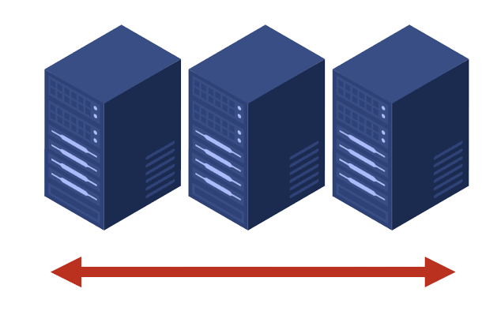

# Trabajo práctico integrador de Simulación

Este repositorio de GitHub contiene los recursos y archivos relacionados con el TPI de la cátedra Simulación de la Universidad Tecnológica Nacional Facultad Regional de Rosario (UTN FRRo), titulado "Análisis de los umbrales para el escalado horizontal de base de datos NOSQL".

Viendo la proliferación de las arquitecturas apoyadas en la nube, es necesario analizar uno de los principales beneficios que este paradigma otorga: la elasticidad. Actualmente es posible aumentar o disminuir los recursos computacionales usados por un sistema en función a la demanda en un momento dado. En este trabajo, nos centramos en el caso de las bases de datos NoSQL, las cuales se caracterizan por escalar horizontalmente para brindar mayor disponibilidad.

En este repositorio subiremos el archivo .alp generado por AnyLogic (el cuál tendrá la simulación) y el paper (o informe) en formato .pdf del trabajo práctico integrador.

    

# Integrantes           Legajo
- Facundo Braida        46095
- Ramiro Di Giacinti    47772
- Bruno Mollo           47773
- Adriel Gorosito       47066
- Lucía Cappellini      47799

# Profesores:
-  Leale, Guillermo
-  Flamini, Jorge
-  Torres, Juan Ignacio

